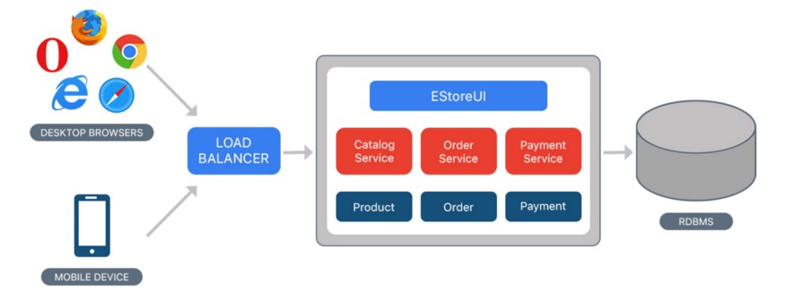
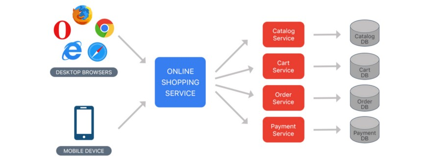

# Architectural Patterns

## Monolithic Apps
- In software engineering, a monolithic application describes a single-tiered software application in which the user interface and data access code are combined into a single program from a single platform.
- A monolithic application is self-contained and independent from other computing applications. The design philosophy is that the application is responsible not just for a particular task, but can perform every step needed to complete a particular function

## Microservices
- Microservices are an approach to application development in which a large application is built as a suite of modular services (i.e. loosely coupled modules/components). Each module supports a specific business goal and uses a simple, well-defined interface to communicate with other sets of services.

## Service Oriented Architecture
- Service-Oriented Architecture (SOA) is a style of software design where services are provided to the other components by application components, through a communication protocol over a network. Its principles are independent of vendors and other technologies ??
- Need to explore this further. Don't see the major differences from Microservices

## CQRS And Event Sourcing
- Eventing Sourcing Architecture is having multiple services subscribe to specific events like a profile update  that gets published to a log. The components then update based off that log instead of direct implementations.
- CQRS is Command Query Responsibility Segregation. This splits architecture into separate Read/Write paradigms. 

## Serverless
- Serverless computing is the act of building applications that backbone utilizes cloud functions to run ad-hoc. This doesn't require traditional web servers hosted on bare metal, but utilizes cloud infastracture for cold starts, etc.

