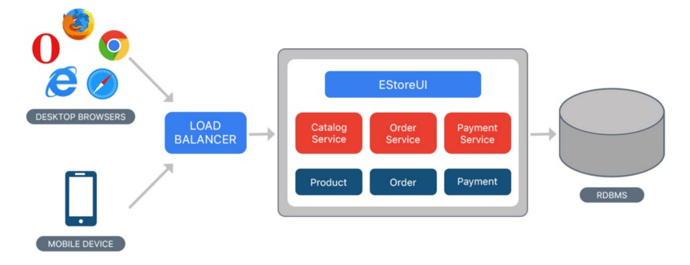

# Architectural Patterns

## Monolithic Apps
- In software engineering, a monolithic application describes a single-tiered software application in which the user interface and data access code are combined into a single program from a single platform.
- A monolithic application is self-contained and independent from other computing applications. The design philosophy is that the application is responsible not just for a particular task, but can perform every step needed to complete a particular function

## Microservices
- Microservices are an approach to application development in which a large application is built as a suite of modular services (i.e. loosely coupled modules/components). Each module supports a specific business goal and uses a simple, well-defined interface to communicate with other sets of services.
